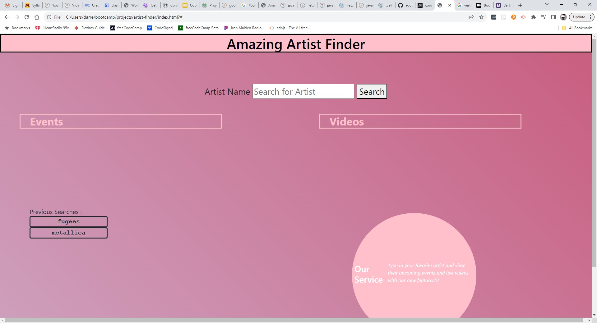

# artist-finder
Awesome Artist Finder

## Description
Allows the site visitor to enter a performer's name and then searches Seatgeek for upcoming shows for that performer and searches Youtube for relevant videos

The free version of the Youtube API search that we're using has a cap of 10000 quota coins a day and each call uses 101 coins. 100 for the big initial search, and 1 for the second call that gets detailed info for each entry returned by the first search.

Uses : dayJS, jQuery, Bootstrap, YouTube Search API, Seatgeek API

## Credits

Development Team - Hans Zilzer (@hanszilzer), Jalynn White (@jalynnwhite), Adam Wehner (@ahwehn), Darren Brain (@dbrainz), 

## License

License
The MIT License (MIT)

Copyright (c) 2015 Chris Kibble

Permission is hereby granted, free of charge, to any person obtaining a copy of this software and associated documentation files (the "Software"), to deal in the Software without restriction, including without limitation the rights to use, copy, modify, merge, publish, distribute, sublicense, and/or sell copies of the Software, and to permit persons to whom the Software is furnished to do so, subject to the following conditions:

The above copyright notice and this permission notice shall be included in all copies or substantial portions of the Software.

THE SOFTWARE IS PROVIDED "AS IS", WITHOUT WARRANTY OF ANY KIND, EXPRESS OR IMPLIED, INCLUDING BUT NOT LIMITED TO THE WARRANTIES OF MERCHANTABILITY, FITNESS FOR A PARTICULAR PURPOSE AND NONINFRINGEMENT. IN NO EVENT SHALL THE AUTHORS OR COPYRIGHT HOLDERS BE LIABLE FOR ANY CLAIM, DAMAGES OR OTHER LIABILITY, WHETHER IN AN ACTION OF CONTRACT, TORT OR OTHERWISE, ARISING FROM, OUT OF OR IN CONNECTION WITH THE SOFTWARE OR THE USE OR OTHER DEALINGS IN THE SOFTWARE.

---
